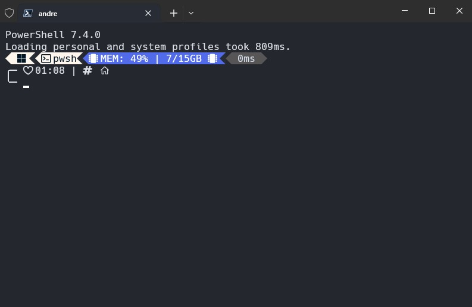
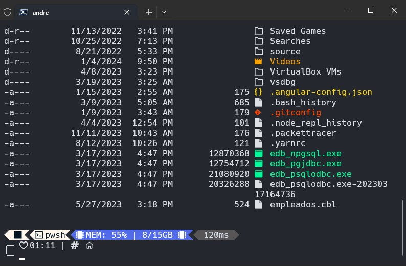

# Dotfiles & Config

Este repositorio contiene todas las tecnologías y configuraciones que uso en mi día a día en mi sistema operativo Windows 10.

## Tabla de contenidos
- [Dotfiles \& Config](#dotfiles--config)
  - [Tabla de contenidos](#tabla-de-contenidos)
  - [Link Rápidos](#link-rápidos)
  - [Windows Terminal](#windows-terminal)
  - [Compiladores y Herramientas](#compiladores-y-herramientas)
  - [Extensiones para Visual Studio Code](#extensiones-para-visual-studio-code)

## Link Rápidos

- [Terminal Config](https://github.com/dev-eloy/dotfiles/tree/main/.config/terminal)
- [Visual Studio Code Config](https://github.com/dev-eloy/dotfiles/tree/main/.config/vscode)

## Windows Terminal



Instalar:

- [Windows Terminal from Microsoft Store](https://www.microsoft.com/store/productId/9N0DX20HK701?ocid=pdpshare)
- [Powershell from Microsoft Store](https://www.microsoft.com/store/productId/9MZ1SNWT0N5D?ocid=pdpshare)
  Queremos que cuando abramos el Windows Terminal por defecto ya abra el nuevo Powershell que recien instalamos, entonces van al apartado de "Settings" → "Startup" → "Default Profile" → "Powershell"
- [Oh my Posh](https://ohmyposh.dev/docs/installation/windows)
    1. Tendran que abrir el Powershell anteriormente instalado y correr el siguiente comando para instalarlo:
    ```
    winget install JanDeDobbeleer.OhMyPosh -s winget
    ```
    2. Crear un nuevo "Profile" para empezar configurar Oh my Posh:
    ```
    New-Item -Path $PROFILE -Type File -Force
    ```
    3. Verificar si esta creado el archivo con:
    ```   
    notepad $PROFILE
    ```
    4. Se les abrira un notepad y tendran que que añadir esta linea en el archivo:
    ```   
    oh-my-posh init pwsh | Invoke-Expression
    ```
    Con esto ya instalamos Oh my Posh, cuando vuelvan a abrir la Terminal les aparecera distinto, pero todavia falta customizarlo.
    5. Para customizarlo tendran que instalar [Hack Nerd Font](https://www.nerdfonts.com/font-downloads) e instalar todas fuentes que vienen en el .Zip
    6. En el Powershell van "Settings" → "Profiles" → "Defaults" → "Appearance" → "Font Face" y seleccionan "Hack Nerd Font" y ahora van a aparecer en el Powershell los iconos.
    7. En este repositorio de igual forma les voy a dejar en la carpeta .config el "settings.json" para que puedan importar las configuraciones de la terminal como las tengo yo.
    8. Para instarlas [Themes](https://ohmyposh.dev/docs/themes) en Oh My Posh tendran que ejecutar este comando:
    ```   
    Get-PoshThemes
    ```   
    9. Depues para instalar un tema tendran que ejecutar nuevamente el comando 
    ```   
    notepad $PROFILE
    ```   
    10. Reemplazamos el contenido del archivo por:
    ```   
    oh-my-posh init pwsh --config "$env:POSH_THEMES_PATH\jandedobbeleer.omp.json | Invoke-Expression
    ```
    11. Instalar iconos para carpetas y archivos con [Terminal Icons](https://github.com/devblackops/Terminal-Icons). En la terminal:
    ```   
    Install-Module -Name Terminal-Icons -Repository PSGallery
    ```
    ```   
    notepad $PROFILE
    ```
    Y agregar esta línea en el archivo:
    ```   
    Import-Module -Name Terminal-Icons
    ```
    
    

## Compiladores y Herramientas

Los compiladores y las tecnologías que uso son:

- [Node.js](https://nodejs.org/en)
- [Python](https://www.python.org/)
- [JDK Development Kit](https://www.oracle.com/ar/java/technologies/downloads/)
- [Apache Netbeans](https://netbeans.apache.org/front/main/)
- [Visual Studio Code](https://code.visualstudio.com/)
- [Visual Studio para .NET](https://visualstudio.microsoft.com/es/)
- [Github Desktop](https://desktop.github.com/)
- [XAMPP](https://www.apachefriends.org/es/index.html)
- [Git](https://git-scm.com/)
- [Postman](https://www.postman.com/downloads/)
- [Docker Desktop](https://docs.docker.com/desktop/install/windows-install/)
- [Window Subsystem for Linux](https://www.youtube.com/watch?v=ZO4KWQfUBBc&t=317s&ab_channel=FaztCode)
- [C++](https://www.youtube.com/watch?v=v3ENcQpoA5A&t=130s&ab_channel=FaztCode)
- [Microsoft PowerToys](https://apps.microsoft.com/detail/XP89DCGQ3K6VLD?hl=en-us&gl=US)

## Extensiones para Visual Studio Code

- [Prettier - Code Formatter](https://marketplace.visualstudio.com/items?itemName=esbenp.prettier-vscode)
- [Error Lens](https://marketplace.visualstudio.com/items?itemName=usernamehw.errorlens)
- [Live Server](https://marketplace.visualstudio.com/items?itemName=ritwickdey.LiveServer)
- [Tailwind CSS IntelliSense](https://marketplace.visualstudio.com/items?itemName=bradlc.vscode-tailwindcss)
- [Tailwind Fold](https://marketplace.visualstudio.com/items?itemName=stivo.tailwind-fold)
- [Thunder Client](https://marketplace.visualstudio.com/items?itemName=rangav.vscode-thunder-client)
- [Postman](https://marketplace.visualstudio.com/items?itemName=Postman.postman-for-vscode)
- [Better Comments](https://marketplace.visualstudio.com/items?itemName=aaron-bond.better-comments)
- [YAML](https://marketplace.visualstudio.com/items?itemName=redhat.vscode-yaml)
- [Material Icon Theme](https://marketplace.visualstudio.com/items?itemName=PKief.material-icon-theme)
- [Symbols Icon Theme](https://marketplace.visualstudio.com/items?itemName=miguelsolorio.symbols)
- [Image Preview](https://marketplace.visualstudio.com/items?itemName=kisstkondoros.vscode-gutter-preview)
- [Fluent Icons](https://marketplace.visualstudio.com/items?itemName=miguelsolorio.fluent-icons)
- [Dainty - One Dark Pro Theme](https://marketplace.visualstudio.com/items?itemName=alexanderte.dainty-one-dark-pro-vscode)
- [Dobri Next - Themes and Iconsn](https://marketplace.visualstudio.com/items?itemName=sldobri.bunker)
- [Python](https://marketplace.visualstudio.com/items?itemName=ms-python.python)
- [C#](https://marketplace.visualstudio.com/items?itemName=ms-dotnettools.csharp)
- [ES7+ React/Redux/React-Native snippets](https://marketplace.visualstudio.com/items?itemName=dsznajder.es7-react-js-snippets)
- [Docker](https://marketplace.visualstudio.com/items?itemName=ms-azuretools.vscode-docker)
- [Database Client](https://marketplace.visualstudio.com/items?itemName=cweijan.vscode-database-client2)
- [Markdown All in One](https://marketplace.visualstudio.com/items?itemName=yzhang.markdown-all-in-one)


